# 讯飞工作室官网 V1.0

## Preview

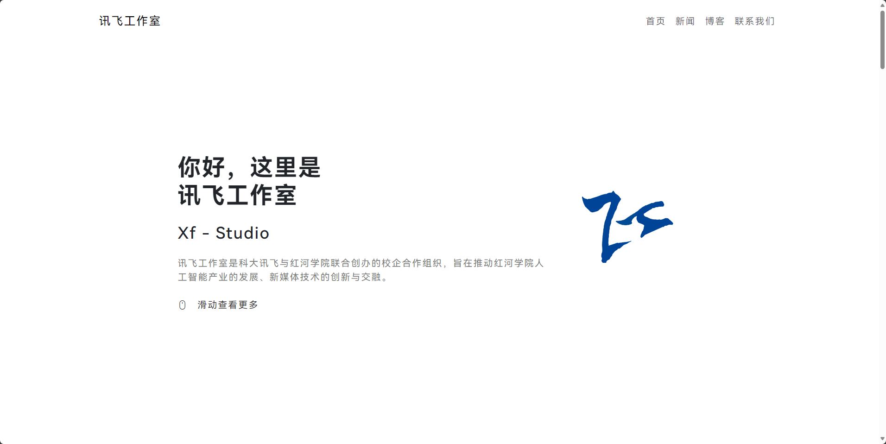

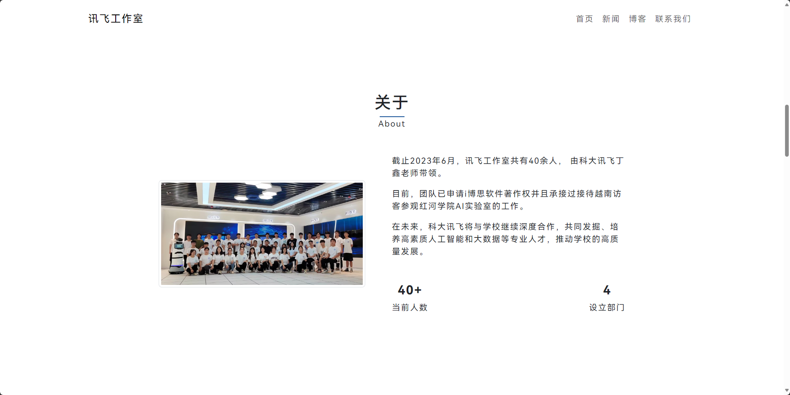

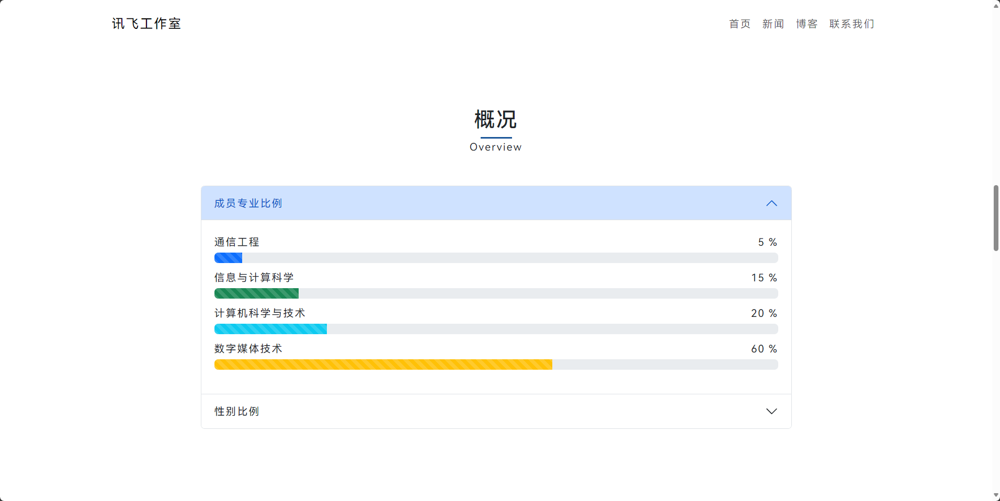

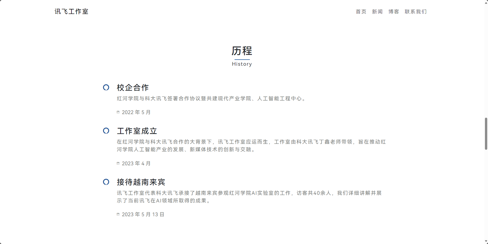

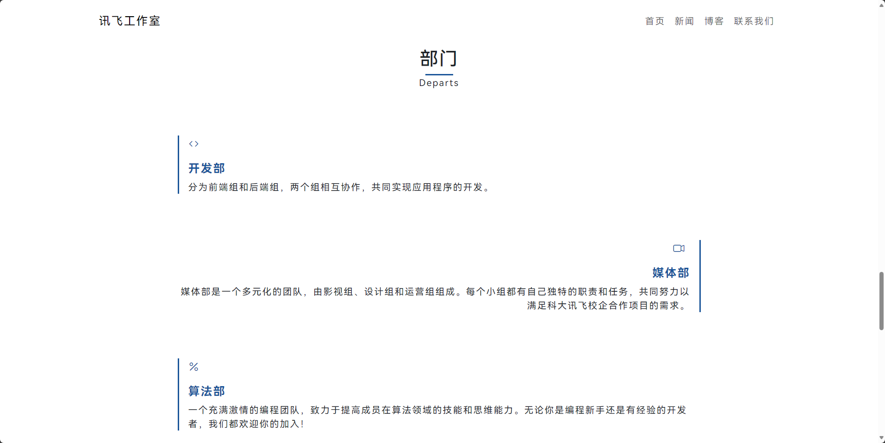

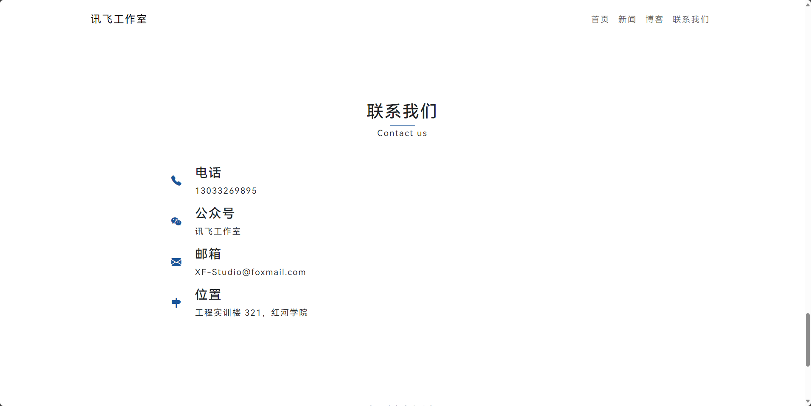

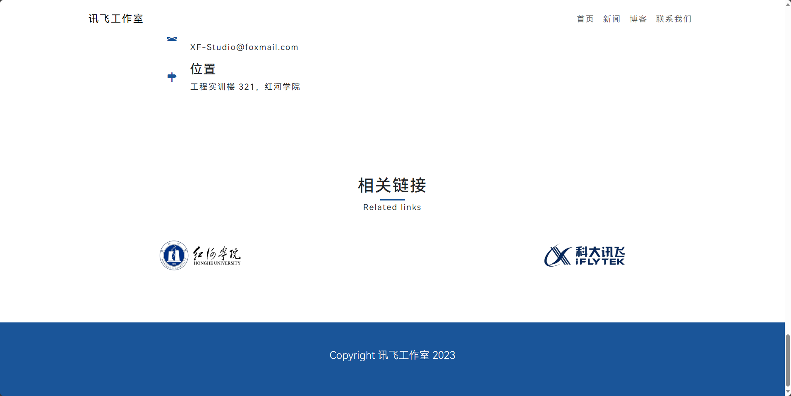

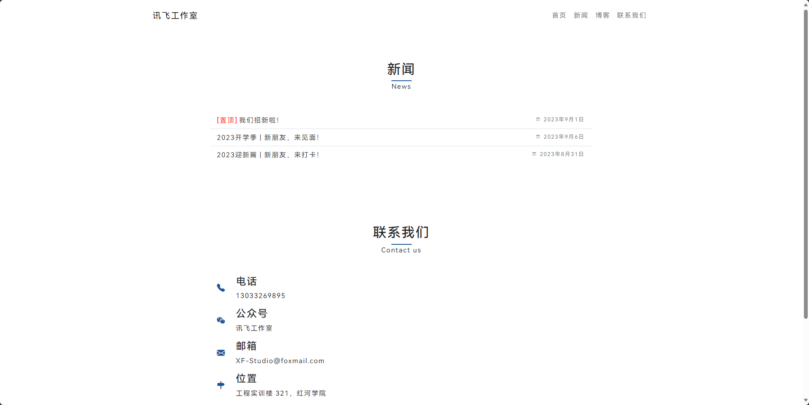

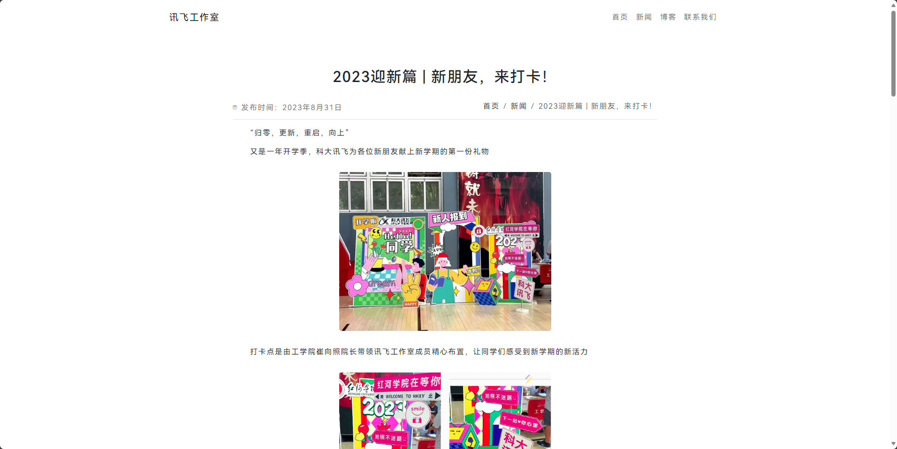

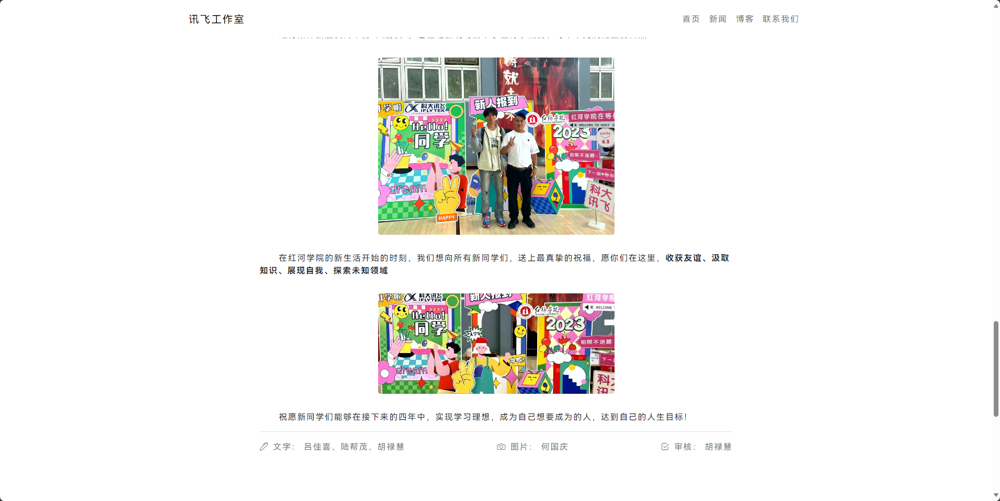

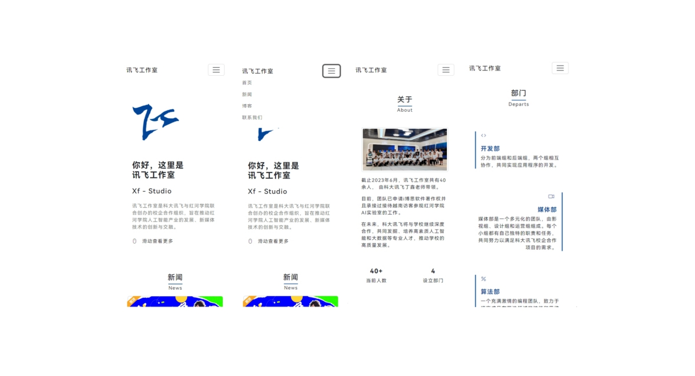

## Skill

**HTML、CSS**

**Less**

CSS 的预处理器，支持嵌套、全局变量、运算等多种原生 CSS 不自带的语法，大幅度提高 CSS 书写效率。

**Bootstrap 5**

CSS 框架，有很多基本样式（如首页的新闻卡片、导航栏等）

**响应式**

使用媒体查询对用户使用的设备宽度进行检查，通过 Flex 布局等对页面进行相应适配

## Question

1. 首页新闻封面是多大？

   900*383 px 或者更大的整数倍

2. 网页设计要点？

   - 布局设计吸取了多款同类新型企业站 / 工作室站经验，使用适当的留白及字号、字重呈现内容
   - 字体选用了华为的 **HarmonyOS**（免费商用）
   - 部门板块使用左右式渐进竖向排列，使视觉更加饱满
   - 首页的 LOGO 切换到移动端时会通过修改定位的方式进行移动
   - 配色风格统一，采用深蓝（\#1A5599），更具现代感
   - 图标源自 iconfont 及 bootstrap 自带的图标库，最大程度地搭配内容

3. 总结？

   网页使用了多种 H5 新标签、融合了多种设计、、文件归类较为清晰、CSS 实现了目前常见网站的多种效果（如招新页的四个部门按钮效果来源于京东），以及目前前端必须要会的移动端适配，如果能自己动手做出类似效果，那 HTML + CSS 阶段就不会有什么大问题了。

5. V2.0 版本？

   目前正在制作 V2.0 版本，使用主流的 Vue、SpringBoot 等多种框架，拥有增加新闻、审核新闻、账号管理、人员管理、首页信息设置等多种功能，敬请期待...

